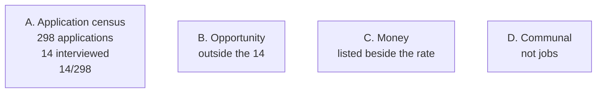

# Figures and tables

Every series is from `paper/RESULTS.md` or a recompute of `adjudication/applications__full_census.csv`. No chart may drop the companion not-exact count. No chart may plot package ledger totals. Overlay conversations are not stacked onto the 14.

Publication copy does not include hashed provider IDs.

## Cross-reference

| ID | What | Cite from |
|---|---|---|
| Fig 1 | Monthly exact-date applications, Freeze 1 | Results (time series); Discussion (trough and peak) |
| Fig 2 | Monthly exact-date applications, full 298 | Results (time series); Discussion (Freeze 2 added dates, not interviews) |
| Fig 3 | Role-lane mix, 221 versus 298 | Results (lanes); Methods (kappa licenses the 221) |
| Fig 4 | Two denominators, 14/221 and 14/298 | Results (interviews); Discussion (volume without interview-set events) |
| Fig 5 | Freeze 1 terminal outcomes | Results (closes); Discussion (do not call 124 ghosted) |
| Fig 6 | Four scoreboards | Results (money listed beside the rate); Discussion (instrument blind to most paid work); Conclusion |
| Table 1 | Role-lane counts | Results |
| Table 2 | The 14 interviewed applications | Results |
| Table 3 | Exact-date monthly series | Results; Fig 1 and Fig 2 source |

## Fig 1. Applications per month, Freeze 1, exact dates only

**Caption.** Applications with `date_precision = exact` in the Freeze 1 census of 221. n exact = 195. n not exact = 26, all `evidence_bound`, not plotted. Window 2025-06-01 through 2026-08-29, America/New_York. Zero in 2025-09 and 2025-10 is not a claim of zero search activity. Fullsteam 2025-09-29 is evidence_bound.

**Axis.** X: calendar month. Y: application count. Unit: applications.

**Series.** 2025-06 5, 2025-07 19, 2025-08 16, 2025-09 0, 2025-10 0, 2025-11 1, 2025-12 2, 2026-01 7, 2026-02 10, 2026-03 21, 2026-04 26, 2026-05 22, 2026-06 28, 2026-07 33, 2026-08 5.

**Annotation.** Peak 2026-07 = 33. Print "n not exact = 26" in the figure area, not only in the caption.

## Fig 2. Applications per month, full 298, exact dates only

**Caption.** Applications with `date_precision = exact` in the full census of 298. n exact = 201. n not exact = 97, of which 71 are LinkedIn `relative_display` stamps from pages 1 to 10 (`date_capture` 2026-08-29) and 26 are Freeze 1 `evidence_bound`. The 71 relative stamps are off-chart. Freeze 2 added 6 exact Jobright dates (2026-01 +2, 2026-05 +2, 2026-06 +2). Peak 2026-07 remains 33.

**Axis.** Same as Fig 1.

**Series.** 2025-06 5, 2025-07 19, 2025-08 16, 2025-09 0, 2025-10 0, 2025-11 1, 2025-12 2, 2026-01 9, 2026-02 10, 2026-03 21, 2026-04 26, 2026-05 24, 2026-06 30, 2026-07 33, 2026-08 5.

**Do not.** Upgrade relative stamps. Do not draw a second peak from the 71.

## Fig 3. Role lane, Freeze 1 versus full census

**Caption.** Mutually exclusive `role_lane`. Freeze 1 n = 221, licensed by Cohen's kappa 0.9510 on 211 matched keys. Full census n = 298. Freeze 2 is a documented mapping of structured lists; kappa is not recomputed on the 77. Freeze 2 added 27 explicit GTM rows and 0 unspecified rows.

**Series, Freeze 1 / 298.** explicit_gtm_engineering 86 / 113; unspecified 35 / 35; sales_bd_partnerships 28 / 34; growth_demand_marketing 22 / 32; sales_solutions_engineering 15 / 31; other 18 / 30; revops_gtm_ops_strategy 9 / 14; product_ai_technical 8 / 9.

**Do not.** Treat Freeze 2 lanes as a second independent coding study.

## Fig 4. Application-to-interview rate on two denominators

**Caption.** Interviewed applications are derived from freeze events in {recruiter_screen, hiring_manager_interview, panel, technical_exercise, final_round} intersected with the application census. Freeze 1: 14/221. Full census: 14/298. Employer-artifact stratum: 14/220. The 77 net-new `platform_log` rows carry no interview-set events. That is not a claim about LinkedIn conversations.

**Annotation.** All 14 are Freeze 1. Glytec and Opsin are opportunity and are not in the 14.

**Do not.** Stack overlay or opportunity interviews onto the 14. Do not print a retired prior-audit percent as this freeze's rate.

## Fig 5. Freeze 1 terminal outcomes (n = 221)

**Caption.** Coded `terminal_outcome` on Freeze 1 only. rejected_no_interview 73, rejected_after_interview 6, role_paused_or_closed 18, still_open 124. Zero `no_response`. Amendment A2 was not applied. The 77 Freeze 2 rows are blank and are not in this figure. The 124 are not a ghosting count.

**Do not.** Draw a 298 reply pie.

## Fig 6. Four scoreboards (schematic)

**Caption.** Four boards kept separate. A: 298 applications, 14 interviewed, rate 14/298. B: opportunity conversations outside the 14 (Glytec, The Hog, Pin, Hotglue, Opsin, The Kiln, Mercor contract, WorkOS, overlay Adam at Stellar Growth, overlay Doug at Renoir). C: money. Mixmax, Mercor contract, Mobb, Kivira.health paid. Mercor marketplace rows sit in A without conversion. TrueBuilt sits in A; the quote is not paid. D: communal (Jorge, Kellen). Names in C still need a publication naming pass.

**Do not.** Add B into A and print one interview rate. Do not title the figure as if none of the money is in 298.

## Optional figures (not required for this draft)

**Fig 7 optional.** GTM modifier among explicit GTM rows (86, then 113). Plain is the majority in both.

**Fig 8 optional.** Exact-date GTM share by month, Freeze 1, March through July 2026. Exact GTM counts: 2026-03 15, 2026-04 19, 2026-05 7, 2026-06 11, 2026-07 21. Do not treat the optional figure as a second kappa.

## What is not a figure

- Package 321 or 325 as a bar next to 298.
- A completeness percentage.
- A combined conversation count replacing 14/298.
- Hashed `gth_`, `cal_`, or `tok_` pointers in published artwork.
