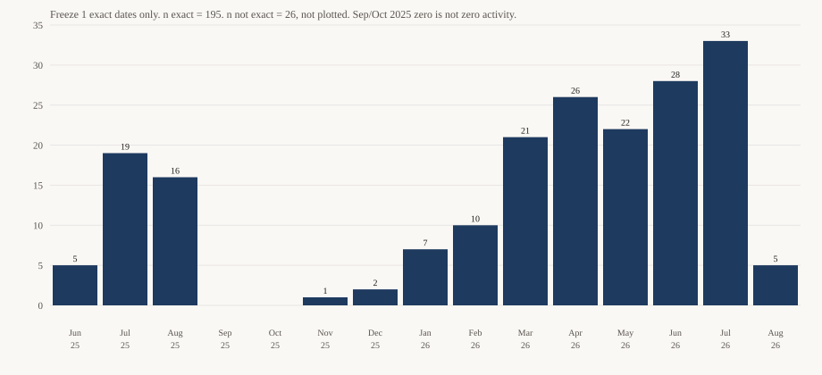
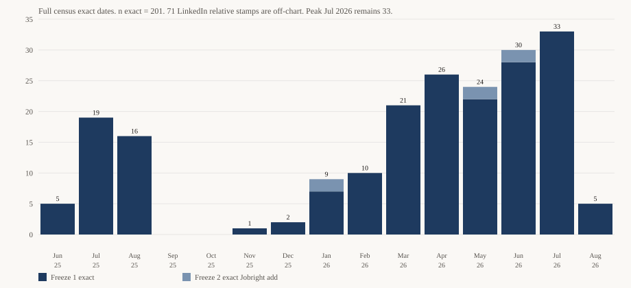
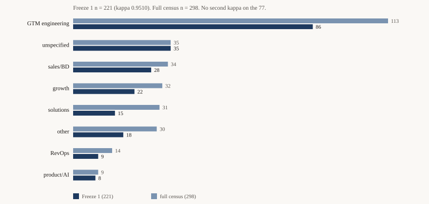
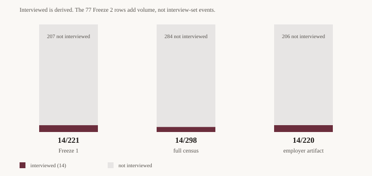
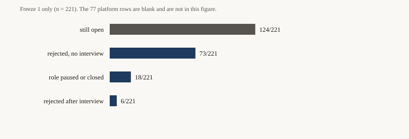
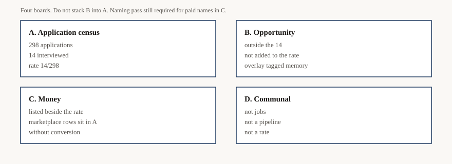
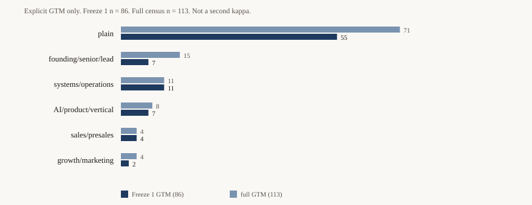

<!-- Generated by paper/build_manuscript.py. Edit the section files, then regenerate. -->

# A two-register census of one job search: 298 applications, 14 interviews, and zero coded offers

## Abstract

I reconstructed my own job search for 2025-06-01 through 2026-08-29 (America/New_York) as a forensic application census. I am the subject and the author. That dual role is a limitation.

A job search has two pipelines. The application census counts roles I submitted. The opportunity register holds recruiter-initiated processes, referrals, matching-platform contracts, and consulting prospects. Mixing them makes an application-to-interview rate uninterpretable.

Four freezes locked evidence without recoding earlier extracts. Freeze 1 independently coded Gmail and Calendar into 221 applications. Freeze 2 mapped LinkedIn applied-list pages 1 to 10 and a Jobright tracker onto that list and added 77 `platform_log` rows. Freeze 3 (remaining personal mail and calendar) and Freeze 4 (a care-package sidecar plus a memory-tagged overlay) added zero applications. The census is **298 applications** at 273 companies.

Interviewed is derived from freeze events, never stored. **14** of the 298 reached an interview-set event. The rate is **14/298**. All 14 are Freeze 1. The 77 Freeze 2 rows carry no interview-set events. That is not a claim that LinkedIn produced no conversations. Opportunity interviews stay out of the 14.

Coded offers from the 298 are **0**. Offer-language search is closed on one study mailbox and still open on the personal mailbox.

Completeness is unmeasured. The overlap stratum required for stratified capture recapture (LinkedIn rows submitted through an external ATS) was never labeled. I do not print a completeness percentage.

The largest paid outcomes in the working record arrived through employment, consulting, or opportunity channels this applications instrument cannot treat as 14/298. Marketplace receipts for one of those employers sit in the 298 and did not convert. Paid-engagement names still need a publication naming pass.

# Introduction

People do not know how many jobs they applied to. The evidence is scattered across ATS mail, applied lists, aggregator agents, and DMs, and every source double-counts the others. A naive sum of trackers is not a census. A screenshot is not a census. A feeling that the search was "a lot of applications" is not a census.

I reconstruct one search as a forensic application census. The window is 2025-06-01 through 2026-08-29, America/New_York. I am the subject of the dataset and the author of this paper. That dual role is a limitation. Methods states it in the body rather than as an apology.

A job search has two pipelines. Mixing them makes both unmeasurable.

The **application census** is roles I submitted. It is the only denominator for an application-to-interview rate. Interviewed, in this paper, is derived from freeze events, not stored as a rollup that can drift from the event list.

The **opportunity register** is recruiter-initiated processes, referrals, matching-platform contracts, and consulting prospects. Those conversations happened. Some produced interviews. Some produced money. They do not enter the application census, because putting them there would inflate conversion with outcomes that did not come from applying.

A freeze is a locked snapshot of evidence. After it, those artifacts are not recoded. Later work may add a source or a sidecar overlay. It may not rewrite the earlier extracts. That discipline is how an application-to-interview rate stays reproducible when new mail, a second ledger, or a recalled conversation arrives.

This paper does not report a completeness percentage. The overlap stratum required to estimate one (LinkedIn rows submitted through an external ATS) was never labeled. Ninety-five percent complete remains a goal.

I first state how the census was built (Materials and methods), then the quantities the freeze can defend (Results), then what those quantities do and do not mean (Discussion). Completeness, dual role, and missing exports are in the body, not only in an appendix.

# Materials and methods

I am the subject of this dataset and the author of this paper. That dual role is a limitation. It is not a footnote. Independent model coding of the Gmail extracts is not a human gold standard. A stranger with the same exports should be able to rebuild the census. That is the test.

## Window and unit

The window is 2025-06-01 through 2026-08-29, America/New_York, inclusive. Fifteen months. Earlier audits searched from late August 2025, so June 2025 through early November 2025 was unharvested in those ledgers rather than empty.

The unit of analysis is one application cycle: `company_canonical` plus `role_as_listed` plus `cycle`. Same company and a materially different title is two applications. Same company, same title, plus reminder and rejection threads, is one. A new receipt after a terminal outcome on the same company and title is a new cycle. FOSSA (receipt 2026-04-22, decline 2026-05-20, second receipt 2026-05-21) and Attentive (2026-06-22, decline 2026-07-07, second receipt 2026-07-15) are the worked cases. A key that omitted cycle would collide those pairs.

I never invent a company or a title. A receipt that omits the role is `unspecified`.

## Two registers

A job search has two pipelines. Mixing them makes both unmeasurable.

The **application census** is roles I submitted. It is the only denominator for an application-to-interview rate.

The **opportunity register** is recruiter-initiated processes, referrals, matching-platform contracts, and consulting prospects. Those conversations happened. They produced interviews and, in some cases, money. They do not enter the application census, because putting them there would inflate conversion with outcomes that did not come from applying.

WorkOS is the closed example. TopHire approached me for a remote GTM Engineer role in August 2025. A slot was booked. No submission receipt exists in the frozen corpus. `register = opportunity`. It stays in the dataset. It does not enter 14/298.

## Freeze discipline

A freeze is a locked snapshot of evidence. After it, those artifacts are not recoded. Later work may add a source or a sidecar overlay. It may not rewrite the earlier extracts.

**Freeze 1.** Gmail and Calendar extracts. keeganmoody33@gmail.com, logs 001 to 021, 994 threads. 33@lecturesfrom.com, logs 022 to 029, 177 threads. Calendar on 33@lecturesfrom.com: 31 events across five 90-day blocks with no keyword filter. Transferred keegan@lecturesfrom.com calendar: reachable and empty. Two independent extracts, `cursor` and `bravo`, coded without seeing each other's rows. Alpha CSVs were not on disk for this pass. After include/exclude adjudication and alias merge: **221** applications with `register = application`.

**Freeze 2.** LinkedIn applied-list pages 1 to 10 (99 rows, relative stamps, `date_capture` 2026-08-29) and the Jobright tracker (40 rows, exact dates). Freeze 1 Gmail was not recoded. Platform rows were mapped onto Freeze 1 on company, role, and cycle. Titles that expand or abbreviate the same opening do not increment the census. Net-new `platform_log` applications: **77**. Full census: **298**. Platform files carry no interview-set events. LinkedIn `submission_channel` is `unknown`. The applied list does not label Easy Apply versus an external ATS. This codebook does not import the package value `linkedin_easy_apply`. Page 10 of the applied list is full, so a later page is not ruled out.

**Freeze 3.** Remaining personal Gmail on keeganmoody33@gmail.com: Q7 re-run from the start (195 unique threads), Q6, Q9 (178 unique threads, including spam and trash), Q3b. Primary calendar, five 90-day blocks, no keyword filter: 338 events. Hidden calendars MCAT PREP and SI CHM222 were listed and not swept. Net-new applications: **0**. Opportunity rows added in freeze coder files: Pin, Hotglue, Opsin, The Kiln. They stay out of 298. Freeze 3 is a documented addendum, not a second independent coding pair. Role-lane kappa is not recomputed.

**Freeze 4.** A Claude care package dropped 2026-08-30 is a sidecar under `package/`. It is a different assembly. It is not this freeze's census. Treatments that would add, merge, or remove an `application_id` remain held. A subject-confirmed overlay in `coding/confirmed/` records recall tagged `evidence_system = memory`. Overlay rows are not copied into the 298. The 14 cannot move by accident: `adjudication/derive_metrics.py` reads `cursor`, `alpha`, and `bravo` only.

## Harvest

Queries are recorded in `QUERY-MANIFEST.md`. A Gmail query is done only when the API returns no further page token.

I searched receipt language, ATS domains, aggregator channels, rejection language without the word application, sent mail, interview and scheduling language, and (on 33@lecturesfrom.com) offer language including spam and trash. Q1 through Q9 are exhausted on both mailboxes. Q11 offer language is closed on 33@lecturesfrom.com and was not run on keeganmoody33@gmail.com this pass. Personal Q9 is receipt language, not offer language. Unharvested is not empty.

Committed artifacts store hashed evidence pointers: `gth_` for Gmail threads, `cal_` for calendar events, `tok_` for tokens, `eml_` for third-party addresses. Study mailbox labels stay so retrieval scope remains auditable. Published copy does not include raw or hashed provider IDs.

Ladders full list is absent. YC Work at a Startup dashboard is absent. Prior-audit workbooks labeled [S1] and [S2] are absent. Talentpluto and Jobgether receipts exist; underlying employers are still unnamed. Those stops bound the census. They are not silent omissions.

## Coding and adjudication

The codebook (`knowledge/03-codebook.md`, rev 1) is the logging schema. Changes to it would invalidate prior rows. This tree did not apply package codebook rev 2 (`converted_to_contract`, `no_response` anchoring, community source split).

Table 1 is applications. Table 2 is events. `interviewed` is not a field. It is derived: at least one event whose `event_type` is in {recruiter_screen, hiring_manager_interview, panel, technical_exercise, final_round}. A stored rollup and a stored event list will eventually disagree. I compute the rollup.

Every date carries a precision label. Monthly series use only `date_precision = exact`. Relative LinkedIn stamps are not upgraded to calendar dates. Evidence-bound dates are not plotted as if they were exact.

Evidence class is `employer_artifact` or `platform_log`. That split is the sensitivity stratum.

Role lane is one mutually exclusive category. Cohen's kappa on the Freeze 1 intersection (n = 211 matched keys) is 0.9510. Include/exclude percent agreement is 0.9905. Include kappa is 0.7452. The two include disagreements were The Hog and BX Studio. Both stay opportunity.

Freeze 2 and Freeze 3 are documented column mappings of structured files and new artifacts onto the existing census. They are not a second independent LLM pair. Kappa is not recomputed on the 77.

## Completeness

Ninety-five percent completeness is a goal, not a verified claim. The intended estimator is stratified two-source capture recapture, restricted to LinkedIn rows submitted through an external ATS, because only there could both LinkedIn and employer mail have observed the same application.

That overlap stratum is unmeasured. The Freeze 2 LinkedIn file does not label Easy Apply versus external ATS. Naive Lincoln-Petersen on Easy Apply versus ATS mail is invalid: those sources are near-disjoint by construction. Easy Apply is visible to LinkedIn and invisible to ATS mail. An unstratified estimator would inflate uniqueness and understate completeness. I did not run it. I do not print a completeness percentage.

## Offers

A zero is a positive claim. It requires a search for offers, not the absence of offers in a ledger. Freeze 1 and Freeze 2 code no `offer_accepted` or `offer_declined` on census rows. Q11 on 33@lecturesfrom.com, including trash, found no employment offer letter. The personal mailbox offer-language family is still open. The Mercor Instant Work Offer is opportunity. It states I did not apply directly.

## Overlay

If I say a conversation happened, it is logged. Recall is tagged memory so a skeptic can drop it. Happened is not the same as `register = application`. Mixmax, the Mercor contract path, Pin, The Hog, Glytec, Opsin, Hotglue, The Kiln, Adam (Stellar Growth), and Doug (Renoir, meeting 2025-10-27, before AICRO) stay out of 298. Frozen `discovery_source` is not recoded to GTM Cafe. That value is not in this codebook.

## What Results is licensed to use

From this methods section, Results may print: 298 applications; 273 companies on those applications; 14 interviewed applications; 14/298, 14/221, and 14/220; 0 coded offers from the 298; Freeze 1 closes on 221; role-lane counts on 221 with kappa; role-lane counts on 298 as a documented mapping without a second kappa; exact-date monthly series with the not-exact count beside the chart; money listed beside the rate, not inside it. Results may not print a completeness percent, a reply percent over 298, a combined conversation count as a rate, or the retired prior-audit figures as this freeze's finding.

## Limitations, in the body

I coded my own search. Model pairs are independent of each other, not of me. Freeze 2 LinkedIn is pages 1 to 10. Freeze 3 skipped two hidden calendars. Offer-language is unclosed on the personal mailbox. Ladders, YC, and the prior workbooks are missing. Twelve LinkedIn rows and AnyInt AI are held, not minted. `work_type = Atlanta` on three rows is a vocabulary error and is not interpreted.

# Results

I report measurements from this freeze. Interpretation sits in Discussion. The number ledger is `paper/RESULTS.md`. Figure IDs are in `paper/figures.md`.

The unit is applications, not companies. The census is **298 applications** at **273 companies**. A foreign ledger that spans 298 companies is a different quantity. I label the unit every time the two could collide.

## Application census

Freeze 1 locked 221 applications after two independent Gmail and Calendar extracts were adjudicated (Fig 3, Table 1). Freeze 2 mapped LinkedIn applied-list pages 1 to 10 and the Jobright tracker onto that 221 without recoding Gmail. Fifty-six platform rows overlapped Freeze 1. Net-new `platform_log` applications: **77**. Full census: **298**.

Evidence class on the 298: `employer_artifact` 220, `platform_log` 78. One of those 78 is the Freeze 1 Jobright.ai Product Manager Early Career row. The other 77 are Freeze 2. Evidence tier: A 205, B 16, C 77. The 77 Freeze 2 rows are the C stratum.

Freeze 3 (remaining personal Gmail and the keeganmoody33 primary calendar, 338 events) added **0** applications. Freeze 4 (care-package sidecar and subject-confirmed overlay) added **0** applications. Overlay rows are not copied into the 298.

Thirteen companies have more than one row, which produces 25 extra rows on top of 273 companies. DeKalb County School District is ten STAR substitute titles, all `role_lane = other`. Mercor is six marketplace evaluator and expert receipts. FOSSA and Attentive are `c1` then `c2`. Two AICRO rows are two cycles (email February 2026, LinkedIn May 2026). They are not a twin of the Doug overlay at Renoir.

`work_type = Atlanta` on three rows is a vocabulary error. I do not interpret it.

## Interviewed applications

Interviewed is derived. An application is interviewed when freeze events include at least one of `{recruiter_screen, hiring_manager_interview, panel, technical_exercise, final_round}` and that `application_id` sits in the 298. `adjudication/derive_metrics.py` reads `cursor`, `alpha`, and `bravo` only. Overlay events cannot move this count.

Interviewed applications: **14**. Rate **14/298**. On Freeze 1 only: **14/221**. On the employer-artifact stratum: **14/220**. All 14 are Freeze 1. All 14 are `employer_artifact`.

The 14, with stored `terminal_outcome` as Freeze 1 coded it:

| company | lane | interview-set events (cursor) | stored close |
|---|---|---|---|
| Beautiful.ai | unspecified | hiring_manager_interview | rejected_after_interview |
| Dagster Labs | explicit_gtm_engineering | hiring_manager_interview | rejected_after_interview |
| Every.to | explicit_gtm_engineering | hiring_manager_interview | still_open |
| Great Question | growth_demand_marketing | recruiter_screen, two hiring_manager_interview | rejected_after_interview |
| HartleyCo | explicit_gtm_engineering | recruiter_screen | rejected_after_interview |
| Hologram | explicit_gtm_engineering | recruiter_screen, panel | still_open |
| Hypergen | explicit_gtm_engineering | hiring_manager_interview | still_open |
| jobmail.io | growth_demand_marketing | recruiter_screen | rejected_no_interview |
| Orchestry | explicit_gtm_engineering | two recruiter_screen | rejected_after_interview |
| Pearl | explicit_gtm_engineering | three hiring_manager_interview | still_open |
| PhrasIQ | unspecified | two hiring_manager_interview | still_open |
| RevSpring | explicit_gtm_engineering | recruiter_screen | still_open |
| TestGorilla | explicit_gtm_engineering | recruiter_screen | still_open |
| Weave | sales_bd_partnerships | hiring_manager_interview | rejected_after_interview |

Glytec is not in the 14. Dagster, Hypergen, and Orchestry are. Opsin is opportunity and is not in the 14. Pin, Hotglue, The Hog, The Kiln, the Mercor contract path, WorkOS, Adam (Stellar Growth), and Doug (Renoir) are also outside the 14. Mixing those conversations into the numerator would replace an application-to-interview rate with a combined conversation count. I do not print that combined count as a rate.

jobmail.io is the stored-versus-derived disagreement. It is in the 14 because of a `recruiter_screen`. The stored close is `rejected_no_interview`. I disclose it. I do not recode Freeze 1 (`paper/DEFECTS.md`).

The 77 net-new Freeze 2 rows carry **zero** interview-set events (Fig 4). That sentence is about events on those 77 application rows. It is not a claim that LinkedIn produced no conversations. Melavex stays in the 298 without an interview minted. The Hog is opportunity. TrueBuilt is in the 298; the later project quote is not an interview-set event.

## Offers

Coded offers from the 298: **0** `offer_accepted` and **0** `offer_declined`.

Q11 offer-language on 33@lecturesfrom.com, including trash, found no employment offer letter. Hits were marketing plus one employment-adjacent AIT Home Delivery background-screening thread that is not an offer and is not in the 298. The authenticated mailbox for that pass was not keeganmoody33@gmail.com. The personal-mailbox offer-language family is still open. Unharvested is not empty.

The cursor `offer` event is the Mercor Instant Work Offer. That process is opportunity. The message states I did not apply directly. It does not enter 14/298.

## Freeze 1 closes

Freeze 1 coded a terminal outcome on every one of the 221 (Fig 5). The 77 platform rows are blank.

| terminal_outcome | n of 221 |
|---|---|
| rejected_no_interview | 73 |
| rejected_after_interview | 6 |
| role_paused_or_closed | 18 |
| still_open | 124 |

Zero `no_response`. Amendment A2 (outbound-anchor silence) was not applied. The 124 are not a ghosting count. `evidenced_silence_days` is uncomputable on this freeze.

A reply statistic, if used, is defined on Freeze 1 only: 73 of 221 received an explicit decline before interview. I do not mix the 77 blank outcomes into a percent over 298.

Of the 14 interviewed applications, six are `rejected_after_interview`, seven are `still_open`, and one is the jobmail.io disagreement above.

## Role lanes

Cohen's kappa on `role_lane` for the Freeze 1 intersection (n = 211 matched keys) is 0.9510. That kappa licenses lane counts on the 221. Freeze 2 is a documented column mapping. Kappa is not recomputed on the 77.

Table 1. Role lane, Freeze 1 (n = 221) and full census (n = 298). See Fig 3.

| role_lane | Freeze 1 | Freeze 2 add | full 298 |
|---|---|---|---|
| explicit_gtm_engineering | 86 | 27 | 113 |
| unspecified | 35 | 0 | 35 |
| sales_bd_partnerships | 28 | 6 | 34 |
| growth_demand_marketing | 22 | 10 | 32 |
| sales_solutions_engineering | 15 | 16 | 31 |
| other | 18 | 12 | 30 |
| revops_gtm_ops_strategy | 9 | 5 | 14 |
| product_ai_technical | 8 | 1 | 9 |

Interviewed applications by Freeze 1 lane:

| role_lane | interviewed / Freeze 1 n |
|---|---|
| explicit_gtm_engineering | 9/86 |
| unspecified | 2/35 |
| growth_demand_marketing | 2/22 |
| sales_bd_partnerships | 1/28 |
| sales_solutions_engineering | 0/15 |
| other | 0/18 |
| revops_gtm_ops_strategy | 0/9 |
| product_ai_technical | 0/8 |

GTM modifiers among the 86 Freeze 1 explicit GTM rows: plain 55, systems/operations 11, founding/senior/lead 7, AI/product/vertical 7, sales/presales 4, growth/marketing 2. Among the 113 in the 298: plain 71, founding/senior/lead 15, systems/operations 11, AI/product/vertical 8, sales/presales 4, growth/marketing 4 (Fig 7).

## Monthly series, exact dates only

Monthly charts use `date_precision = exact` only. Relative LinkedIn stamps are not upgraded. Evidence-bound dates are printed as the companion count, not plotted as if they were exact.

Freeze 1: n exact = 195, n not exact = 26 (Fig 1). Full 298: n exact = 201, n not exact = 97, of which 71 are LinkedIn `relative_display` (Fig 2).

| month | Freeze 1 exact | full 298 exact |
|---|---|---|
| 2025-06 | 5 | 5 |
| 2025-07 | 19 | 19 |
| 2025-08 | 16 | 16 |
| 2025-09 | 0 | 0 |
| 2025-10 | 0 | 0 |
| 2025-11 | 1 | 1 |
| 2025-12 | 2 | 2 |
| 2026-01 | 7 | 9 |
| 2026-02 | 10 | 10 |
| 2026-03 | 21 | 21 |
| 2026-04 | 26 | 26 |
| 2026-05 | 22 | 24 |
| 2026-06 | 28 | 30 |
| 2026-07 | 33 | 33 |
| 2026-08 | 5 | 5 |

Peak month on both series is 2026-07 at 33 exact. Freeze 2 added six exact Jobright dates: two in 2026-01, two in 2026-05, two in 2026-06. The 71 LinkedIn relative stamps stay off both charts.

Zero exact rows in 2025-09 and 2025-10 is not a claim of zero search activity. Fullsteam 2025-09-29 is `evidence_bound`.

## Money, listed beside the rate

Money is a separate scoreboard (Fig 6). It is not mixed into 14/298.

Paid in the working record, all outside the 14:

- Mixmax: interview, then a two-week trial, then a three-month contractor GTM engagement. Employment/consulting. Freeze 3 exclusion from 298 stands.
- Mercor hourly contract: Claire then Daniel Luo. Opportunity. Instant Work Offer states I did not apply directly.
- Mobb: employment onboarding. Not a search application.
- Kivira.health: three-month GTM consulting.

BCOFA was unpaid and fizzled. TrueBuilt is in the 298; the later project quote is not paid and is not an interview.

Mercor marketplace evaluator and expert receipts (six rows) sit in the 298. They carry no interview-set events and did not convert. The paid Mercor path is the opportunity contract, not those marketplace rows. Do not write that none of the money is in 298. Do not write that the marketplace rows converted.

Names in this working record still need a publication naming pass.

## Four scoreboards, not one rate

A. Artifact applications: 298. Interviewed applications: 14. Rate 14/298.

B. Opportunity conversations outside the 14, including overlay: Glytec, The Hog, Pin, Hotglue, Opsin (James happened; Colossus phone is memory), The Kiln (Patrick happened; Giorgio as interviewer is memory), Mercor contract, WorkOS, Adam at Stellar Growth, Doug at Renoir on 2025-10-27 (meeting predates AICRO).

C. Money: Mixmax, Mercor contract, Mobb, Kivira.health. BCOFA unpaid. Mercor marketplace in 298 without conversion. TrueBuilt in 298, quote not paid.

D. Communal, not jobs: Jorge Macias, Kellen Casebeer.

If I say a conversation happened, it is in the overlay, tagged memory when the source is recall. Happened is not `register = application`. Frozen `discovery_source` is not recoded. GTM Cafe is not in this codebook.

# Figures

## Figure 1. Applications per month, Freeze 1, exact dates only

*Applications with date_precision = exact in the Freeze 1 census of 221. n exact = 195. n not exact = 26, all evidence_bound, not plotted. Window 2025-06-01 through 2026-08-29, America/New_York. Zero in 2025-09 and 2025-10 is not a claim of zero search activity. Fullsteam 2025-09-29 is evidence_bound.*

## Figure 2. Applications per month, full 298, exact dates only

*Applications with date_precision = exact in the full census of 298. n exact = 201. n not exact = 97, of which 71 are LinkedIn relative_display stamps from pages 1 to 10 (date_capture 2026-08-29) and 26 are Freeze 1 evidence_bound. The 71 relative stamps are off-chart. Freeze 2 added 6 exact Jobright dates. Peak 2026-07 remains 33.*

## Figure 3. Role lane, Freeze 1 versus full census

*Mutually exclusive role_lane. Freeze 1 n = 221, licensed by Cohen's kappa 0.9510 on 211 matched keys. Full census n = 298. Freeze 2 is a documented mapping of structured lists; kappa is not recomputed on the 77.*

## Figure 4. Application-to-interview rate on two denominators

*Interviewed applications are derived from freeze events intersected with the application census. Freeze 1: 14/221. Full census: 14/298. Employer-artifact stratum: 14/220. The 77 net-new platform_log rows carry no interview-set events. That is not a claim about LinkedIn conversations.*

## Figure 5. Freeze 1 terminal outcomes (n = 221)

*Coded terminal_outcome on Freeze 1 only. rejected_no_interview 73, rejected_after_interview 6, role_paused_or_closed 18, still_open 124. Zero no_response. Amendment A2 was not applied. The 77 Freeze 2 rows are blank. The 124 are not a ghosting count.*

## Figure 6. Four scoreboards

*Four boards kept separate. A: 298 applications, 14 interviewed, rate 14/298. B: opportunity conversations outside the 14. C: money, listed beside the rate; marketplace rows sit in A without conversion. D: communal, not jobs. Paid-engagement names still need a publication naming pass.*

## Figure 7. GTM title modifiers among explicit GTM rows

*Explicit GTM only. Freeze 1 n = 86. Full census n = 113. Plain is the majority in both. Not a second kappa.*

# Discussion

The application census answers one question: of the roles I submitted, how many reached an interview-set event? That rate is 14/298 (Fig 4). It is not a measure of whether the search produced conversations, and it is not a measure of whether the search produced money. Those are different instruments. Mixing them produces a number nobody can interpret.

## The applications instrument is blind to most of the work that paid

Scoreboard C in Fig 6 is not a footnote. Mixmax (trial then contractor GTM), the Mercor hourly contract, Mobb employment, and Kivira.health consulting made money through employment, consulting, or opportunity paths. None of those paid paths sit in the 14. Mixmax is excluded from the 298. The Mercor contract is opportunity. Mobb is employment. Kivira is consulting.

The honest sentence is not "none of the money is in 298." Six Mercor marketplace evaluator and expert receipts are in the 298. They carry no interview-set events and did not convert. The paid Mercor path is a separate inbound contract. TrueBuilt is in the 298; the later founder quote is not paid.

If I published 14/298 without scoreboard C, a reader would conclude the search failed. The applications instrument cannot treat Mixmax, the Mercor contract, Mobb, or Kivira as 14/298. That is a property of the two-register rule, not a claim that those processes did not happen. Names in this working record still need a publication naming pass.

## Freeze 2 added volume. It did not add interview-set events.

Freeze 1 is 14/221. The full census is 14/298. The 77 net-new `platform_log` rows carry zero events in the interview set (Fig 4). All 14 remain Freeze 1 employer-artifact rows.

That is not a claim that LinkedIn produced no conversations. Melavex is in the 298; a founder asked for a chat and I did not mint an interview. The Hog phone screen is opportunity, so it cannot both falsify "zero interview-set events on the 77" and enter the 14. TrueBuilt applied, then a project quote, which is not an interview-set event.

Exact-date volume still has a shape (Fig 1, Fig 2). Peak 2026-07 is 33 exact on both series. 2025-09 and 2025-10 are 0 exact and are not a claim of zero activity. Freeze 2's six exact Jobright dates move January, May, and June slightly. The 71 LinkedIn relative stamps stay off the chart. Adding them by guesswork would invent a monthly series.

The rate drop from 14/221 to 14/298 is arithmetic from a larger denominator with the same numerator. It is not an inherited prior-audit figure. I do not restate that retired percent as this freeze's finding, and I do not treat 14/298 as a rebuilt version of it.

## Community channels show up in interviews and money more than in frozen ATS receipts

Frozen `discovery_source` was not recoded. GTM Cafe is not in this codebook. Origins live in the overlay so Freeze 1 and Freeze 2 stay reproducible.

Of the 14, PhrasIQ is the one whose frozen `discovery_source` is already Wellfound. HartleyCo is recruiter inbound (client Bluejay). Every.to, Pearl, and Great Question have cafe origins tagged memory. Pin (opportunity, outside the 14) is the same memory class. Mixmax and The Kiln trace to GTM Engineer School in the overlay, not to a recoded census field.

That pattern is a hypothesis about where conversations came from. It is not a coded `discovery_source` distribution over 298. A skeptic who drops memory keeps the artifact columns and still has 14/298.

## Same person, later company is not the same process

Doug Shankman on 2025-10-27 is overlay opportunity at Renoir. The conversation predates AICRO. A later screenshot is later identity. The two AICRO rows in the 298 are two later cycles, neither interviewed. Merging Doug into those rows would invent a process that the 2025-10-27 meeting cannot be.

Adam at Stellar Growth is overlay opportunity. `stellar-substitute` in the 298 is a different employer. Same-name collisions are a merge hazard. They are why the overlay keeps its own keys.

## What 124 still_open is not

Freeze 1 coded 124 of 221 as `still_open` (Fig 5). Amendment A2 was not applied. This freeze stores zero `no_response`. Publishing those 124 as ghosted would recode Freeze 1 with a rule this tree did not apply. A reply statistic I can defend is 73/221, Freeze 1 only: explicit decline before interview. I do not print a reply percent over 298. Platform outcomes are blank.

jobmail.io is the other outcome caution. It is in the 14 by a `recruiter_screen` and stored as `rejected_no_interview`. Interviewed is derived so that a stored close and an event list can disagree without silent drift. I leave the disagreement visible.

## Completeness stays unmeasured

Ninety-five percent completeness was a goal. The overlap stratum the protocol requires (LinkedIn rows that went through an external ATS) was never labeled. I did not run Lincoln-Petersen. An unstratified estimator on Easy Apply versus ATS mail would inflate uniqueness. That limitation belongs in the body because it bounds every count in Results, including 298.

What would still move the census: LinkedIn pages after 10 (page 10 is full), a channel-labeled ATS stratum, Ladders, YC dashboard, confirmation of twelve held LinkedIn rows and AnyInt AI, and an offer-language sweep on keeganmoody33@gmail.com. The care package did not fill those holes. It is a different assembly. I do not adopt its ledger as this freeze's census.

## Dual role

I am the subject and the author. Independent model extracts are independent of each other, not of me. Overlay recall is tagged memory so a stranger can drop it. That does not make 14/298 a feeling. It is an intersection of freeze events with a locked application list. A stranger with the same exports should rebuild it. That remains the test.

# Conclusion

A freeze-disciplined application census of this window yields **298 applications** and **14 interviewed applications**. The application-to-interview rate is **14/298**. Offers from that census are **0** as coded outcomes. Q11 found no employment offer letter on 33@lecturesfrom.com. The personal-mailbox offer-language family is still open.

The largest paid outcomes in the working record arrived through employment, consulting, or opportunity channels the applications instrument cannot treat as 14/298. Mercor marketplace rows sit in the 298 without conversion. Completeness is unmeasured because the Easy Apply versus external ATS overlap was never labeled.

What would change the number: LinkedIn pages after 10, a channel-labeled ATS stratum, Ladders, YC, a personal-mailbox offer-language sweep, and confirmation of held LinkedIn rows. A replication needs the same window, the same two registers, and the same freeze discipline: later sources add; they do not rewrite earlier extracts.

# Acknowledgments

I am the subject of this dataset and the author of this paper. Independent model coding of the Gmail extracts is not a human gold standard. Overlay recall is tagged memory so a skeptic can drop it.

The freeze protocol, the codebook, and the query manifest are what make a stranger's rebuild possible. Errors that remain are mine.

Communal channels in the working record (GTM Cafe, GTM Engineer School, and the people who run those rooms) shaped conversations that sit outside the application census. Naming those rooms is not a finding about rates.

A publication naming pass is still required before paid-engagement names appear in public copy. This working record does not treat that pass as done.

# Sources

Two classes of source stay distinct. This freeze (Gmail and Calendar extracts, platform CSVs, overlay, retrieval logs on this tree) can support findings. Foreign assemblies (absent prior-audit workbooks, the care-package ledger) are cited only to refuse them as this freeze's census.

Published copy never includes raw or hashed provider IDs (`gth_`, `cal_`, `tok_`, `eml_`). Those pointers belong in the working record and in freeze files.

## In-text keys

| key | what it points at |
|---|---|
| [census] | `adjudication/applications__full_census.csv` |
| [adj] | `adjudication/applications__adjudicated.csv` (Freeze 1 221) |
| [events] | `coding/cursor/events__cursor.csv` (interview set derived here) |
| [metrics] | `adjudication/derive_metrics.py` |
| [kappa] | `adjudication/PRE-ADJUDICATION.md` |
| [F2] | `adjudication/FREEZE-2.md` |
| [F3] | `adjudication/FREEZE-3.md` |
| [F4] | `adjudication/FREEZE-4.md` |
| [ORIGINS] | `adjudication/ORIGINS.md`, `adjudication/origins__subject_confirmed.csv` |
| [delta] | `adjudication/package_vs_census_delta.csv` |
| [Q] | `QUERY-MANIFEST.md` |
| [log N] | `logs/retrieval-log-NNN.md` |
| [codebook] | `knowledge/03-codebook.md` rev 1 |
| [S1] | Absent `job_search_reconciled_audit.xlsx`. Historical. Not this census. |
| [S2] | Absent `Keegan_Moody_Job_Applications_Audit_2025-08_to_2026-08.xlsx`. Historical. |
| [pkg] | `package/` sidecar. Different assembly. Do not print its ledger totals as this freeze. |

## Where each Results integer lives

| integer | source |
|---|---|
| 298 applications | [census], register = application |
| 273 companies | distinct `company_canonical` on those 298 |
| 221 | [adj] |
| 77 net-new | [F2] |
| 14 interviewed | [events] ∩ [census]; [metrics] |
| 14/221, 14/298, 14/220 | same, Freeze 1 / full / employer_artifact |
| 0 coded offers | `terminal_outcome` on [census]; Q11 in [log 059] |
| 73 / 6 / 18 / 124 | [adj] `terminal_outcome` |
| role_lane 86 … 8 | [adj]; kappa [kappa] |
| GTM 113 on 298 | [census]; no second kappa |
| 195 / 26 exact | [adj] `date_precision` |
| 201 / 97 exact | [census]; 71 `relative_display` |
| 33 in 2026-07 | exact-date monthly on [census] and [adj] |
| 13 companies, 25 extra rows | [census] |
| 6 Mercor marketplace rows | [census], company Mercor |

## Retired and foreign figures (refuse as findings)

| figure | status |
|---|---|
| 247 applications | [S1], absent workbook, retired |
| 11 interviews | [S1]/[S2], retired numerator |
| 4.45 percent | 11/247, retired |
| 321 | [pkg] on-disk register row count |
| 325 | [pkg] ledger after a Jobright addendum this freeze already contains |
| 101 `no_response` of 200 | [pkg] codebook rev 2 / A2. Not applied here |
| 51 of 325 unlaned | [pkg]. This freeze unspecified is 35/221 |

Naive 325 minus 298 equals 27 is not 27 missing applications. Arithmetic and named rows: [delta], [log 059] C1.

## Retrieval logs this manuscript leans on

| log | use |
|---|---|
| 052 | VERIFY Part A |
| 053 | care-package ingest completion |
| 054 | LinkedIn messages unpacking |
| 055 | pressure-test restatement |
| 056, 057 | overlay and confirmation |
| 058 | Doug predates AICRO; freeze headlines |
| 059 | red-team C1 through C9; Q11 |
